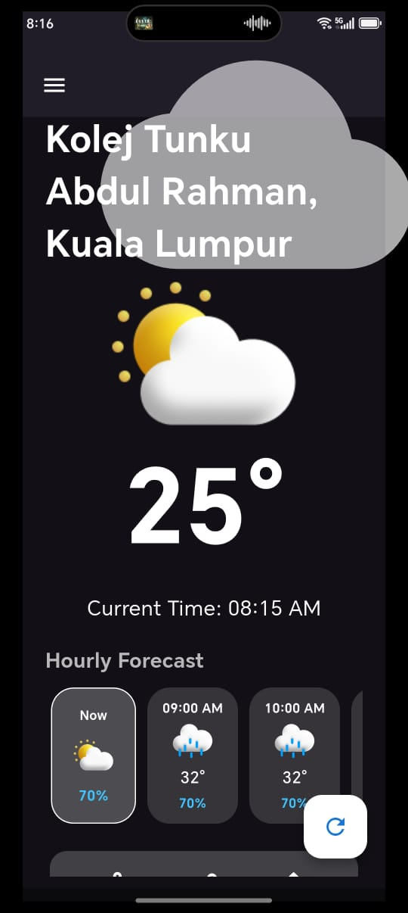
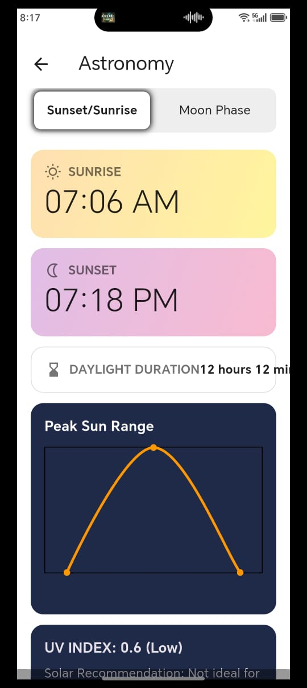
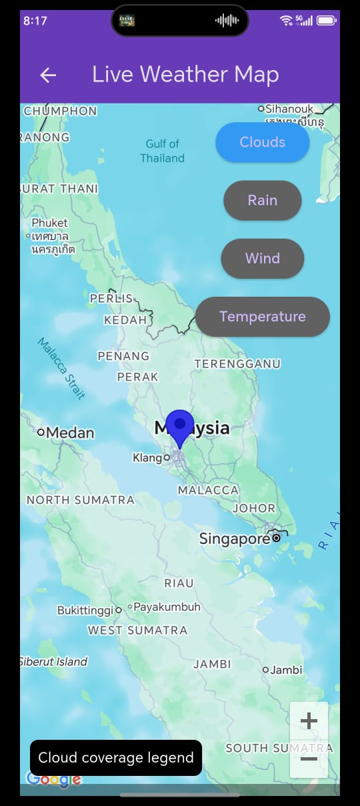

# weather_app

Project Description

This is a Flutter-based Weather Application with real-time weather data, charts, alarms, map integration, and admin management features.
The system uses Supabase as backend and a custom Node.js weather API for weather data processing.

User Features
-View current weather information
-Hourly & 5-day weather forecast
-UV index visualization
-Interactive weather charts
-Live weather map with risk markers
-Location-based weather detection
-Notification alerts for weather risks

Admin Features
-Manage user accounts (activate / deactivate / delete)
-Create and manage weather alarms
-Override weather risk data
-View all weather records
-Monitor system-wide weather alerts

Admin Login Credentials
Email: johnycjy-wm23@student.tarc.edu.my
Password: johny731

You may scan QR code to use our application
path name : assets/images/weather_qrcode.jpeg

Weather Screen

Astronomy Data

Live Weather Map

